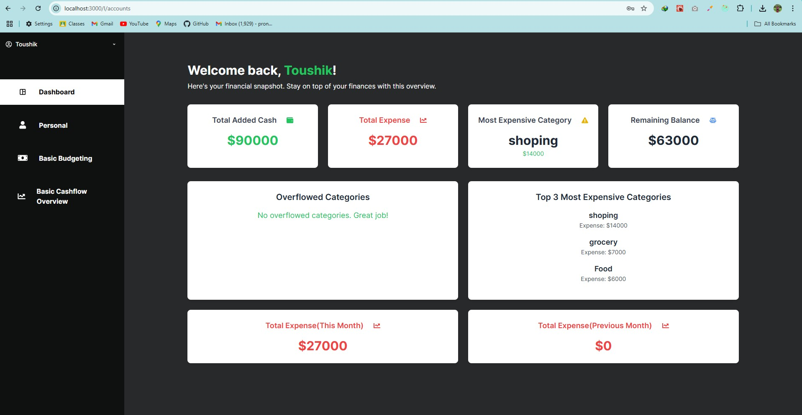

App description:personal finance tracker.user can add their incomes and expenses.user can create budget according to categories and track their expenses.
TechStack:Next.js,Node.js,Express.js,PostgreSQL,tailwind,shadcn/ui
(ss added of the app[note:some of thm are long ss])
UI:         
